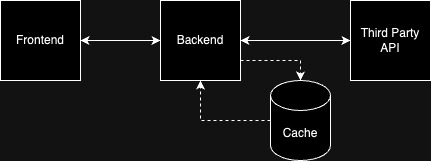

# NFT Viewer

## Overview

NFT Viewer is a web application that allows users to enter an Ethereum wallet address and display a list of Pudgy Penguins NFTs held by that address. The application features a user-friendly interface for viewing NFT details and attributes.

## Setup Instructions

### Prerequisites

- Node.js (v14 or higher)
- npm (v6 or higher)

### Get Started

1. Install dependencies:
   ```bash
   npm install
   ```
2. Start the development server:
   ```bash
   npm start
   ```

- The frontend application will be available at `http://localhost:3000`.

- The backend API will be available at `http://localhost:3000`.

## Technologies and APIs

- **Frontend**: React, TypeScript
- **Backend**: Node.js, Typescript, Express
- **APIs**: OpenSea API for retrieving NFT data

## Challenges and Solutions

1. **Challenge**: Reducing the number of API calls to third-party services.

   - **Solution**: Implemented caching mechanisms to store and reuse previously fetched data.

2. **Challenge**: Ensuring smooth user experience with responsive design.

   - **Solution**: Used CSS frameworks and media queries to make the UI responsive across different devices.

## Assumptions

- The application assumes that the user inputs a valid Ethereum wallet address.
- The caching strategy assumes that the NFT data does not change frequently.

## Architecture


